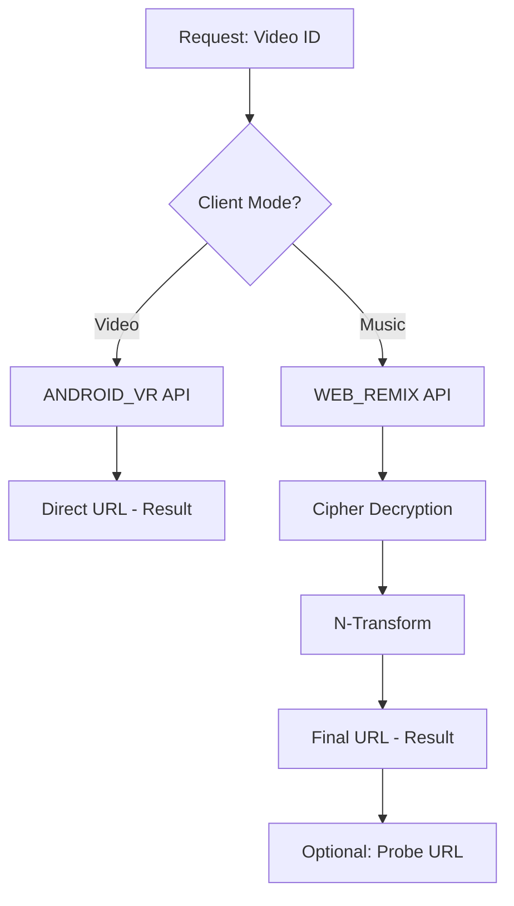

# Architecture Overview

`ytx` is designed with a single goal: **minimal latency for single-video extraction.** 

## The Dual-Client Strategy

Unlike generic extractors that use a "one-size-fits-all" approach, `ytx` selects the optimal YouTube client based on the requested mode:

| Client Mode | Internal Client | Advantage |
| :--- | :--- | :--- |
| **Video** | `ANDROID_VR` | Returns direct URLs. skip cipher decryption entirely (~220ms total). |
| **Music** | `WEB_REMIX` | Access to premium 256kbps audio (itag 141). Requires cipher but optimized. |

## Performance Philosophy

`ytx` achieves its speed through several key architectural decisions:

1.  **Native Go Execution**: Core logic is implemented in Go, eliminating Python/Node overhead.
2.  **Surgical JS Extraction**: Using AST-based analysis to extract only the required ~20KB of cipher code from the 3MB `player.js`.
3.  **HTTP/2 Connection Pooling**: Reusing TCP connections for API calls and script fetching.
4.  **Staggered Pipelining**: Efficient bulk extraction without triggering rate limits.

## High-Level Flow

## Performance Comparison (Cold Start)

| Tool | Video Mode | Music Mode |
| :--- | :--- | :--- |
| yt-dlp | ~1200ms | ~1500ms |
| pytubefix | ~3000ms | ~2800ms |
| **ytx** | **~220ms** | **~500-1100ms** |
