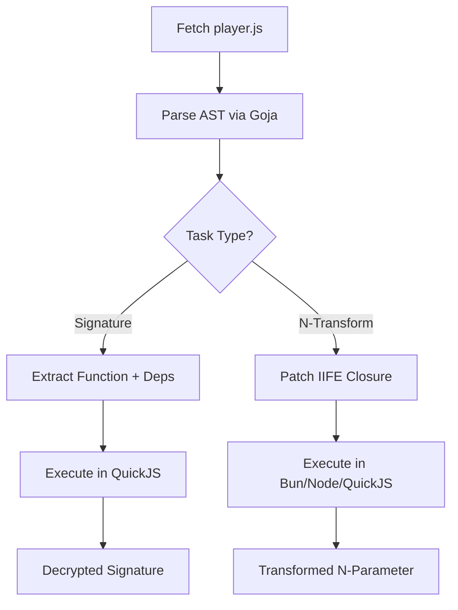

# JavaScript Execution & Extraction Pipeline

YTX employs a hybrid JavaScript execution model designed for high-performance extraction and decryption of YouTube's streaming parameters. This document describes the architecture of the JS engine selection, extraction logic, and the execution pipeline.

## Overview

YouTube uses two primary JavaScript-based protections for its streams:
1.  **Signature Decryption**: A relatively simple transformation (reverse, slice, swap) extracted from `player.js`.
2.  **N-Parameter Transformation**: A complex, highly obfuscated transformation with hundreds of dependencies, used to throttle stream speeds.

YTX handles these using a multi-engine approach to balance speed, compatibility, and zero-dependency requirements.

## Hybrid Execution Model

YTX uses different engines for different tasks based on their specific requirements:

| Task | Engine | Rationale | Performance |
| :--- | :--- | :--- | :--- |
| **Signature Decryption** | QuickJS (CGO) | Small code size, fast startup, ES2020+ support. | ~1ms |
| **N-Transform** | Bun / Node.js | JIT-accelerated, handles large (~3MB) scripts efficiently. | ~30ms (Bun) |
| **N-Transform (Fallback)** | QuickJS | Zero-dependency, embedded runtime. | ~80ms |
| **AST Parsing** | Goja | Native Go parser for reliable dependency extraction. | N/A |

### Engine Selection Logic

The `JSEngine` selection (in `pkg/jsengine.go`) follows a prioritized order when set to `auto`:

1.  **Bun**: Highest priority due to extremely fast startup and execution.
2.  **Node.js**: Standard fallback if Bun is not available.
3.  **QuickJS**: Final fallback, ensuring YTX works even without external runtimes (zero-dependency).

## Extraction Pipeline (`pkg/cipher.go`)

YTX does not execute the entire 3MB `player.js` for signature decryption. Instead, it performs a surgical extraction of the required functions.

### 1. Single-pass AST Indexing
Using `goja/parser`, YTX parses the player script into an Abstract Syntax Tree (AST). The `buildDefinitionIndex` function walks the top-level statements and creates a map of all function and variable definitions.

### 2. Dependency Closure Resolution
Once the target signature function is found, `resolveDependencyClosure` recursively identifies all internal dependencies (other functions or variables) required by the target. This ensures that only the necessary code is extracted, reducing the JS payload from 3MB to ~20KB.

### 3. IIFE Patching for N-Transform
The N-transform function is often trapped inside a massive IIFE (Immediately Invoked Function Expression) closure. To expose it:
- YTX identifies the end of the IIFE.
- It patches the script by injecting an assignment to a global `_exposed` object: `_exposed['funcName'] = funcName;`.
- This allows the runner to access the function after the script is evaluated.

## Component Roles

### `Cipher` (`pkg/cipher.go`)
The orchestrator of the extraction process. It handles:
- Locating function names via regex.
- Extracting code via AST.
- Managing the persistent cipher cache (`~/.cache/ytx/cipher.json`).

### `QuickJSRunner` (`pkg/quickjsrunner.go`)
An embedded CGO-based runner using QuickJS. It is used for all signature decryptions and as a fallback for N-transforms. It includes `browserStubsJS` to emulate a minimal browser environment (`window`, `document`, `navigator`).

### `SubprocessRunner` (`pkg/jsrunner.go`)
Manages external JS runtimes (Bun/Node.js). To minimize overhead:
- **Pre-spawning**: Starts the process in parallel with the `player.js` download.
- **JSON IPC**: Communicates via stdin/stdout using a lightweight JSON protocol.
- **Batching**: Supports `TransformNBatch` to process multiple parameters in a single IPC call.

## Performance Optimizations

1.  **AST Caching**: The results of extraction are cached to disk to eliminate the parsing overhead on subsequent runs.
2.  **Parallel Initialization**: Subprocesses are spawned early (`PreSpawnJSProcess`) while the network request for `player.js` is still in flight.
3.  **Connection Reuse**: The same HTTP client is used for both API calls and player script fetching to benefit from TLS session resumption.
